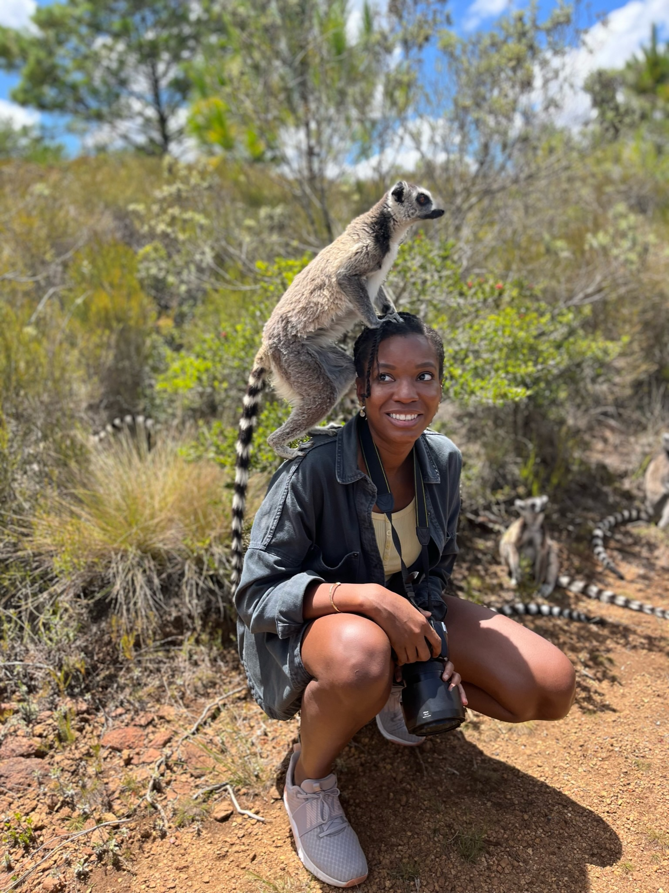

# Hi, I'm Misbath

I'm a current Climate and Health PhD candidate in [Environmental Health Sciences](https://www.publichealth.columbia.edu/academics/departments/environmental-health-sciences-ehs) at [Columbia Mailman School of Public Health](https://www.publichealth.columbia.edu/). My work focuses on the distribution of health benefits from energy transitions in the context of climate change both in the US and in the Global South. Using environmental epidemiology, exposure modeling, machine learning, and qualitative methodologies, I aim to generate community-driven evidence that can support the centering of equity in energy transition policy and initiatives. I hold an MPH in [Environmental Health](https://www.hsph.harvard.edu/environmental-health/) from [Harvard School of Public Health](https://www.hsph.harvard.edu/). During my time at Harvard, I worked on energy, air pollution, and children's health projects in Alaska, Tunisia, and Mongolia. 

My Linkedin page can be found [here](https://linkedin.com/in/misbath-daouda-007089103).

To fill my cup outside of academia, I like to travel and spend time in nature. If some of my favorite [photos from these adventures](photos.html) speak to you, feel free to let me know! 

