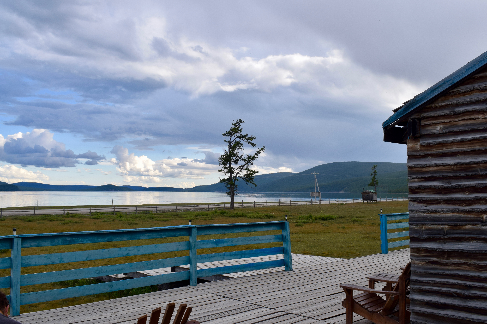

# My Bio

My name is Misbath and I am a current PhD candidate in Environmental Health Sciences at Mailman. Before joining Mailman, I received an MPH in Environmental Health from the Harvard School of Public Health. During my time at Harvard, I worked with UNICEF in Mongolia on a study of the association between air pollution exposure and children respiratory health outcomes in Ulaanbaatar. Prior to that, I assessed the impact of unsustainable tourism activities on the health and well-being of local populations in Tunisia. At Mailman, I plan to conduct research at the intersection of air pollution-related health outcomes, energy use, and environmental policy in the context of climate change.

A detailed description of my training and experience can be found [here](about.html).

This is one of my favorite shots from Mongolia. 

